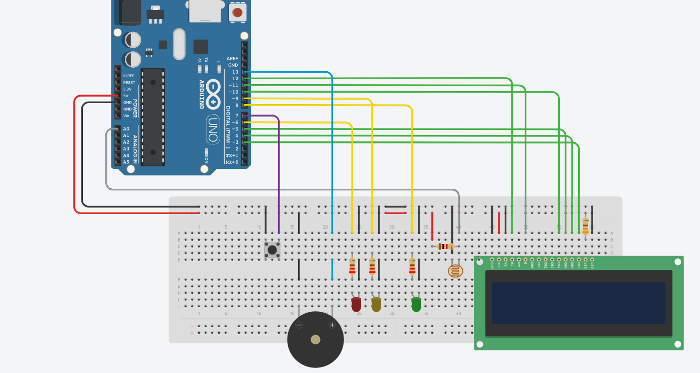

# Descrição

Este projeto tem como objetivo monitorar a luminosidade de um ambiente utilizando um **sensor LDR (fotoresistor)**, indicando a intensidade da luz com **LEDs de sinalização** (verde, amarelo e vermelho) e acionando um **buzzer** quando a luminosidade ultrapassa o limite seguro. O projeto também conta com um **display LCD 16x2** que exibe a porcentagem de luz em tempo real e mensagens para guiar a calibração.

O diferencial desta versão é que a **calibração é feita manualmente pelo usuário através de um botão**, tornando o sistema mais confiável e ajustável ao ambiente específico, além de incluir **suavização da leitura do LDR**, evitando variações bruscas e falsas leituras.

---

## Circuito

<p align="center">
  
</p>

---

## 📝 Funcionalidades

1. **Boas-vindas animadas no LCD** com efeito de digitação.
2. **Calibração manual do LDR pelo botão**:

   * O usuário pressiona o botão para registrar a **luz mínima** do ambiente.
   * Depois pressiona novamente para registrar a **luz máxima**.
3. **Leitura suavizada do sensor**, evitando variações bruscas.
4. **Exibição da porcentagem de luminosidade no LCD**.
5. **LEDs indicativos**:

   * Verde → luz ideal (0-40%)
   * Amarelo → alerta (41-70%)
   * Vermelho → luz excessiva (>70%) e acionamento do buzzer.

---

## ⚙️ Componentes Utilizados

* Arduino Uno (ou compatível)
* Sensor LDR (Fotoresistor)
* 1 x Buzzer
* 3 x LED (Verde, Amarelo, Vermelho)
* 1 x Resistor para cada LED (220Ω – 330Ω)
* 1 x Botão físico para calibração
* Display LCD 16x2
* Jumpers e protoboard

---

## Estrutura do Projeto

```
vinheria_agnello_versao1/
├── vinheria_auto.ino          # Código principal da versão automática
├── imgs/
│   └── circuito_auto.png      # Imagem ilustrativa do circuito
├── README.md                  # Documentação detalhada
└── LICENSE                    # Licença MIT
```

---

## Como Executar o Projeto

1. **Plataforma recomendada:** Arduino IDE (ou simulação via [WokWI](https://wokwi.com))
2. **Monte o circuito** conforme o diagrama disponível em `imgs/image_circuit.png`
3. **Carregue o código** presente no arquivo `vinheria_agnello.ino`
4. **Alimente o circuito** com 5V e aguarde a mensagem de boas-vindas no LCD.
5. Pressione o **botão de calibração**:

   * Primeiro, registre a **luz mínima** cobrindo ou reduzindo a luz sobre o sensor.
   * Depois, registre a **luz máxima** iluminando bem o sensor.
4. Após a calibração, o sistema exibirá a porcentagem de luz e acionará os LEDs e buzzer conforme a intensidade.

---

## Esquema de Montagem

* **LCD:**

  * GND → GND
  * VCC → 5V
  * RS → Pino 12
  * E → Pino 11
  * D4 → Pino 10
  * D5 → Pino 5
  * D6 → Pino 4
  * D7 → Pino 3
  * LED+ → 5V com resistor
  * LED- → GND

* **LEDs:**

  * Verde → Pino 8
  * Amarelo → Pino 9
  * Vermelho → Pino 6

* **Buzzer:**

  * Pino → 13
  * GND → GND

* **Botão de calibração:**

  * Pino → 2
  * GND → GND

* **LDR:**

  * Um terminal → A0 (analógico)
  * Outro terminal → GND com resistor pull-up se necessário

---

## ⚡ Lógica do Código

* O código lê continuamente o valor do LDR e aplica uma **suavização exponencial**.
* Converte a leitura para uma **porcentagem de luz** com base nos limites calibrados.
* Atualiza o LCD com a porcentagem e indica o status usando LEDs e buzzer.
* A calibração garante que o sistema funcione corretamente mesmo em ambientes com luminosidade diferente.

---

## Detalhes Técnicos

* A função `millis()` controla o tempo não-bloqueante das etapas de calibração e alerta.
* A função `map()` transforma a leitura do ADC (0–1023) em percentual compreensível.
* O `delay(500)` controla a taxa de atualização do display.
* O buzzer é acionado com `tone(buzzer, 1000)` e desligado com `noTone(buzzer)`.
* Todo o sistema é autônomo — não requer interação humana após inicializar.

---

## Requisitos de Software

* Arduino IDE 1.8 ou superior
* Biblioteca: `LiquidCrystal.h` (já inclusa na IDE por padrão)

---

## Equipe de Desenvolvimento

| Nome            | Função          |
| --------------- | --------------- |
| Pedro Tavers    | Desenvolvimento |
| Pedro Sales     | Desenvolvimento |
| David Gama      | Desenvolvimento |

---

