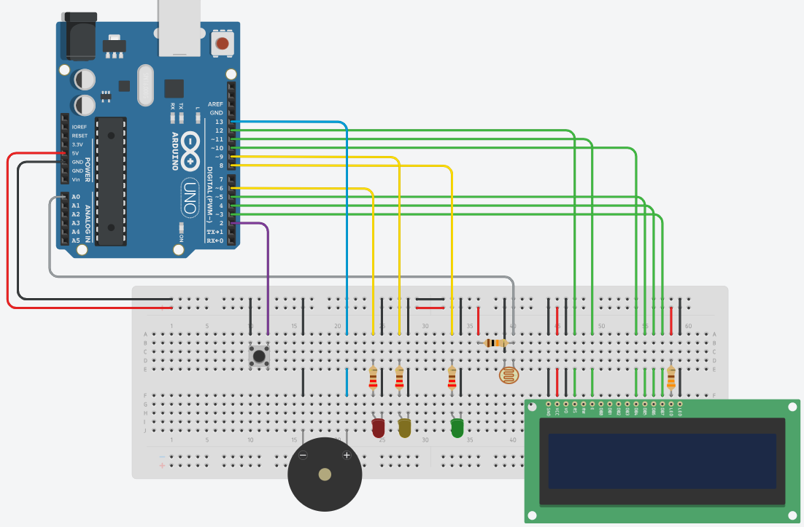

# Vinheria Agnello – Monitoramento de Luminosidade com Arduino

Projeto desenvolvido como parte do desafio acadêmico proposto pela FIAP, com base no cenário fictício da empresa **Vinheria Agnello**. Este sistema embarcado tem como objetivo monitorar a luminosidade do ambiente, garantindo que os vinhos sejam armazenados sob condições ideais de conservação.

O projeto utiliza um sensor LDR para detectar a luz ambiente, realiza calibração dinâmica, apresenta o status via display LCD e aciona alertas visuais (LEDs) e sonoros (buzzer) conforme o nível de luminosidade.

---

## Circuito

<p align="center">
  
</p>

---

## Funcionalidades

* Animação de boas-vindas com o logo da Vinheria no LCD
* Calibração automática da luminosidade mínima e máxima
* Conversão das leituras do LDR em porcentagem (0%–100%) usando `map()`
* Sinalização visual com 3 LEDs:

  * Verde → ambiente ideal
  * Amarelo → nível de alerta
  * Vermelho + buzzer → luminosidade excessiva
* Exibição constante da porcentagem de luz atual no LCD
* Alerta sonoro (buzzer) de 3 segundos caso a luminosidade permaneça alta

---

## Componentes Utilizados

| Componente           | Quantidade | Descrição                            |
| -------------------- | ---------- | ------------------------------------ |
| Arduino Uno          | 1x         | Microcontrolador principal           |
| Sensor LDR           | 1x         | Mede a intensidade de luz ambiente   |
| Display LCD 16x2     | 1x         | Exibe mensagens e leituras           |
| LEDs (3 cores)       | 3x         | Indicam os níveis de luminosidade    |
| Buzzer               | 1x         | Emite alerta sonoro em luz excessiva |
| Resistores 220Ω      | 3x         | Limitam corrente dos LEDs            |
| Resistor 10kΩ        | 1x         | Divisor de tensão com o LDR          |
| Protoboard e Jumpers | Diversos   | Montagem e conexões do circuito      |

---

## Estrutura do Projeto

```
vinheria_agnello_versao1/
├── vinheria_auto.ino          # Código principal da versão automática
├── imgs/
│   └── circuito_auto.png      # Imagem ilustrativa do circuito
├── README.md                  # Documentação detalhada
└── LICENSE                    # Licença MIT
```

---

## Como Executar o Projeto

1. **Plataforma recomendada:** Arduino IDE (ou simulação via [WokWI](https://wokwi.com))
2. **Monte o circuito** conforme o diagrama disponível em `imgs/image_circuit.png`
3. **Carregue o código** presente no arquivo `vinheria_agnello.ino`
4. **Alimente o circuito** com 5V e aguarde a mensagem de boas-vindas no LCD.
5. O sistema iniciará automaticamente o processo de calibração:

   * Cubra o sensor durante os primeiros 3 segundos (mínimo).
   * Ilumine o sensor nos 3 segundos seguintes (máximo).
6. Após calibrar, o sistema exibirá a porcentagem de luminosidade continuamente.

---

## Lógica do Sistema

### Etapa 1 – Boas-vindas

* O LCD exibe “Vinheria Agnello” por 2 segundos.
* Mostra o logo personalizado da taça de vinho usando caracteres criados via `lcd.createChar()`.

### Etapa 2 – Calibração Automática

* Durante 3 segundos, o Arduino lê continuamente o valor mínimo (sensor coberto).
* Em seguida, mede o valor máximo (sensor iluminado).
* Usa a função `map()` para converter as leituras analógicas (0–1023) em 0% a 100%.
* Define margens de segurança (+15 e -15) para evitar erros de sensibilidade.

### Etapa 3 – Monitoramento Contínuo

* O Arduino faz 5 leituras consecutivas do LDR e calcula a média.
* Exibe a porcentagem de luz no LCD.
* Avalia o nível de luminosidade e atua conforme:

  * ≤ 40% → LED verde aceso (OK).
  * 41% a 70% → LED amarelo aceso (alerta).
  * > 70% → LED vermelho + buzzer ativo por 3 segundos.

Durante o alerta, o LCD exibe mensagens de aviso:

```
ALERTA! Luz
Excessiva!
```

Após o tempo de alarme, o sistema retorna ao modo de leitura.

---

## Detalhes Técnicos

* A função `millis()` controla o tempo não-bloqueante das etapas de calibração e alerta.
* A função `map()` transforma a leitura do ADC (0–1023) em percentual compreensível.
* O `delay(500)` controla a taxa de atualização do display.
* O buzzer é acionado com `tone(buzzer, 1000)` e desligado com `noTone(buzzer)`.
* Todo o sistema é autônomo — não requer interação humana após inicializar.

---

## Requisitos de Software

* Arduino IDE 1.8 ou superior
* Biblioteca: `LiquidCrystal.h` (já inclusa na IDE por padrão)

---

## Equipe de Desenvolvimento

| Nome            | Função          |
| --------------- | --------------- |
| Pedro Tavers    | Desenvolvimento |
| Pedro Sales     | Desenvolvimento |
| David Gama      | Desenvolvimento |


---
